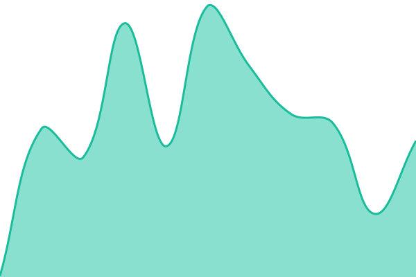
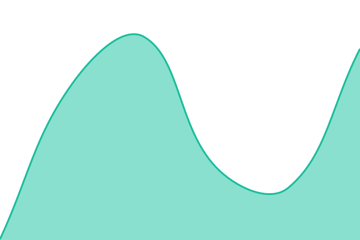
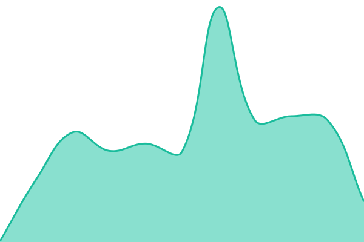
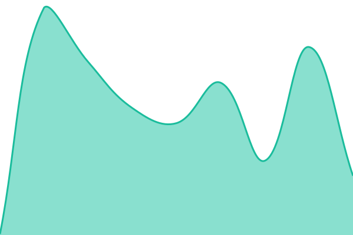
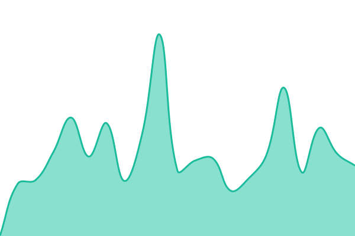
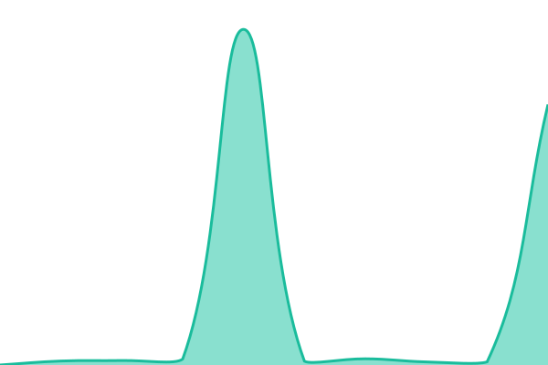
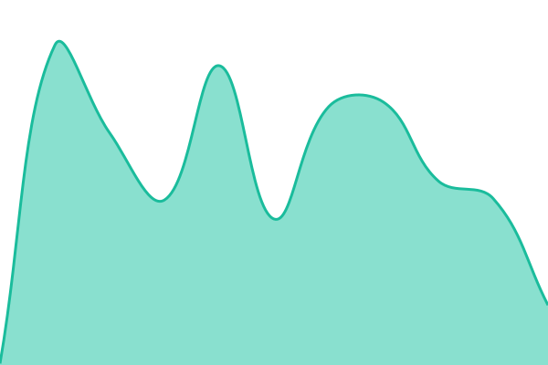
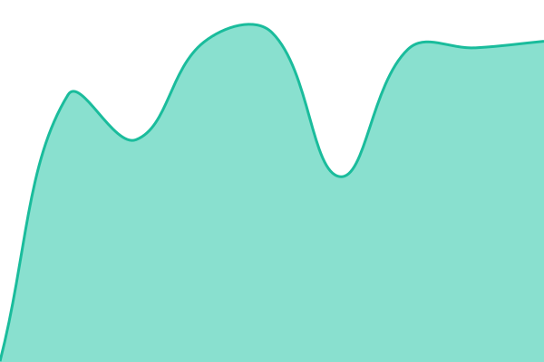

# [📈 Live Status](https://TomerM-nevona.github.io/Nevona-Status): <!--live status--> **All systems operational**

This repository contains the open-source uptime monitor and status page for [TomerM-nevona](https://TomerM-nevona.github.io/Nevona-Status), powered by [Upptime](https://github.com/upptime/upptime).

With [Upptime](https://upptime.js.org), you can get your own unlimited and free uptime monitor and status page, powered entirely by a GitHub repository. We use [Issues](https://github.com/TomerM-nevona/Nevona-Status/issues) as incident reports, [Actions](https://github.com/TomerM-nevona/Nevona-Status/actions) as uptime monitors, and [Pages](https://TomerM-nevona.github.io/Nevona-Status) for the status page.

<!--start: status pages-->
<!-- This summary is generated by Upptime (https://github.com/upptime/upptime) -->
<!-- Do not edit this manually, your changes will be overwritten -->
<!-- prettier-ignore -->
| URL | Status | History | Response Time | Uptime |
| --- | ------ | ------- | ------------- | ------ |
|  [Web app](https://prod.nevona.ai) | 🟩 Up | [web-app.yml](https://github.com/Nevona/Nevona-Status/commits/HEAD/history/web-app.yml) | 

 170ms
     
 | 

<a href="https://status.nevona.ai/history/web-app">100.00%</a>
    

|  [Platform API](https://api.prod.nevona.ai/health) | 🟩 Up | [platform-api.yml](https://github.com/Nevona/Nevona-Status/commits/HEAD/history/platform-api.yml) | 

 169ms
     
 | 

<a href="https://status.nevona.ai/history/platform-api">100.00%</a>
    

|  [Endpoint connectivity](https://workers.prod.nevona.ai/) | 🟩 Up | [endpoint-connectivity.yml](https://github.com/Nevona/Nevona-Status/commits/HEAD/history/endpoint-connectivity.yml) | 

 131ms
     
 | 

<a href="https://status.nevona.ai/history/endpoint-connectivity">100.00%</a>
    

|  [Integrations](https://proxy.prod.nevona.ai/) | 🟩 Up | [integrations.yml](https://github.com/Nevona/Nevona-Status/commits/HEAD/history/integrations.yml) | 

 166ms
     
 | 

<a href="https://status.nevona.ai/history/integrations">100.00%</a>
    

|  [Documentation](https://docs.nevona.ai) | 🟩 Up | [documentation.yml](https://github.com/Nevona/Nevona-Status/commits/HEAD/history/documentation.yml) | 

 214ms
     
 | 

<a href="https://status.nevona.ai/history/documentation">100.00%</a>
    

|  [LLM](https://status.claude.com/api/v2/components/k8w3r06qmzrp.json) | 🟩 Up | [llm.yml](https://github.com/Nevona/Nevona-Status/commits/HEAD/history/llm.yml) | 

 4932ms
     
 | 

<a href="https://status.nevona.ai/history/llm">94.73%</a>
    

|  [Cloud hosting](https://status.cloud.google.com/) | 🟩 Up | [cloud-hosting.yml](https://github.com/Nevona/Nevona-Status/commits/HEAD/history/cloud-hosting.yml) | 

 182ms
     
 | 

<a href="https://status.nevona.ai/history/cloud-hosting">100.00%</a>
    

|  [Workflow compute](https://status.modal.com/index.json) | 🟩 Up | [workflow-compute.yml](https://github.com/Nevona/Nevona-Status/commits/HEAD/history/workflow-compute.yml) | 

 926ms
     
 | 

<a href="https://status.nevona.ai/history/workflow-compute">100.00%</a>
    

|  [Sign-in](https://status.clerk.com/api/v2/status.json) | 🟩 Up | [sign-in-provider.yml](https://github.com/Nevona/Nevona-Status/commits/HEAD/history/sign-in-provider.yml) | 

 449ms
     
 | 

<a href="https://status.nevona.ai/history/sign-in-provider">100.00%</a>
    

|  [Alert test](https://docs.nevona.ai) | 🟩 Up | [alert-test.yml](https://github.com/Nevona/Nevona-Status/commits/HEAD/history/alert-test.yml) | 

 57ms
     
 | 

<a href="https://status.nevona.ai/history/alert-test">100.00%</a>
    

<!--end: status pages-->

[**Visit our status website →**](https://TomerM-nevona.github.io/Nevona-Status)

## 📄 License

- Powered by: [Upptime](https://github.com/upptime/upptime)
- Code: [MIT](./LICENSE) © [Anand Chowdhary](https://anandchowdhary.com)
- Data in the `./history` directory: [Open Database License](https://opendatacommons.org/licenses/odbl/1-0/)
